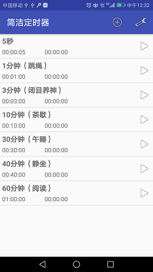
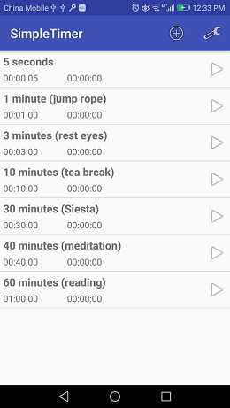

# SimpleTimer
A simple timer for Android. Support multi timers.

How I write code is recorded in [steps](/steps). 
Take a look if you are interested in.

App looks like:

| Chinese | English |
| ------------- |-------------|
|  |  |

Tested in two of my phones:
* Honor 4X : HUAWEI Che1-CL20 (Android 4.4.4 API 19)
* Honor 6X : HUAWEI BLN-AL20 (Android 7.0 API 24)

# Download

[Download V1.0](https://pan.baidu.com/s/1-Brc3wZt04Bz-GdgfwK50Q)
