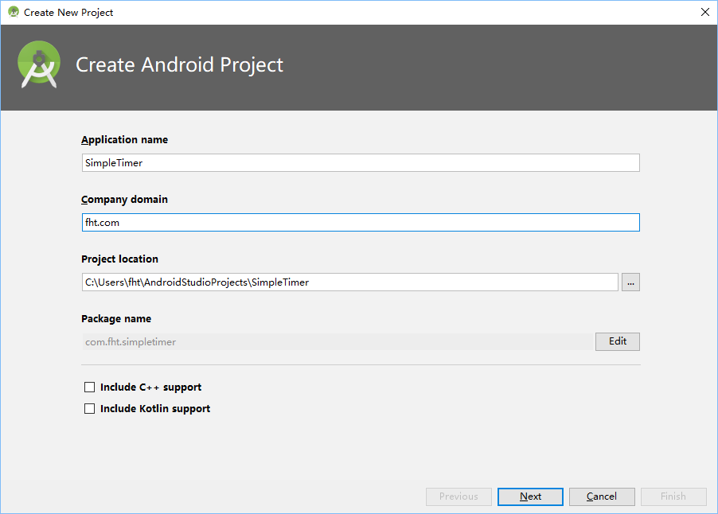
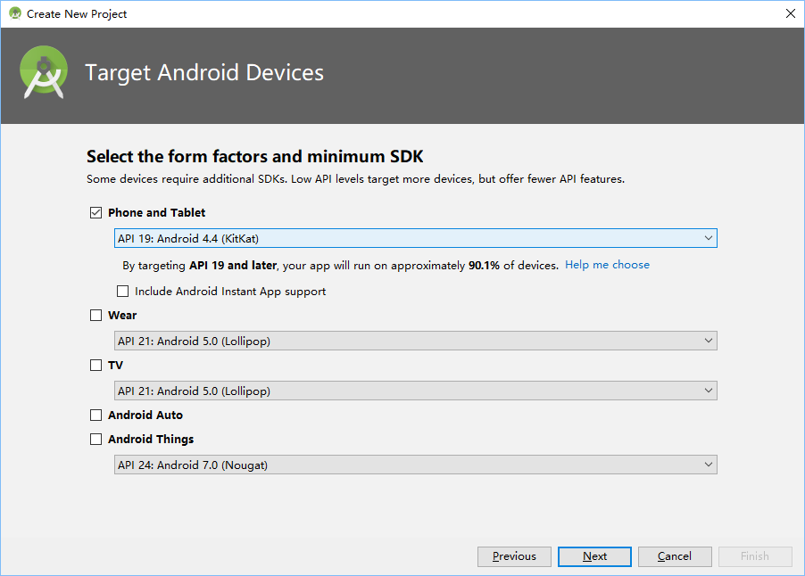
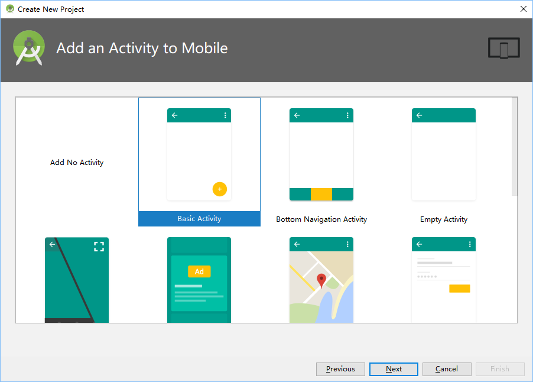
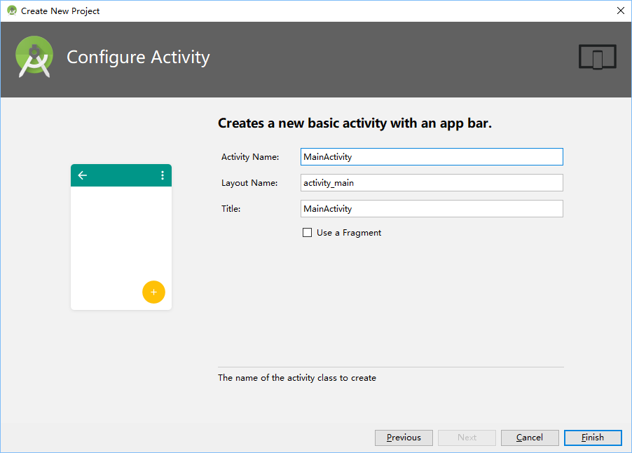

# Create Project
Create empty project 'SimpleTimer' by Android Studio ('AS').

In AS, 'File' -> 'New' -> 'New Project...'

Input Application name 'SimpleTimer', press 'Next'

Use default settings, just press 'Next'

Choose 'Basic Activity', press 'Next'

Press 'Finish'

# Delete unused materials

See git log:

* Update git.
* Remove unused FloatingActionButton.

