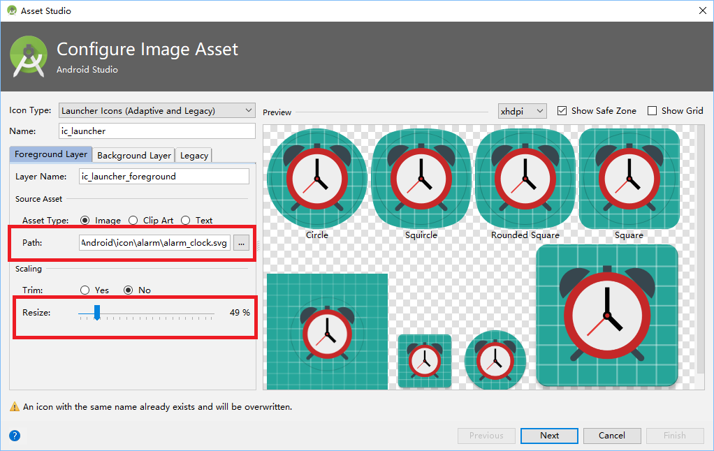
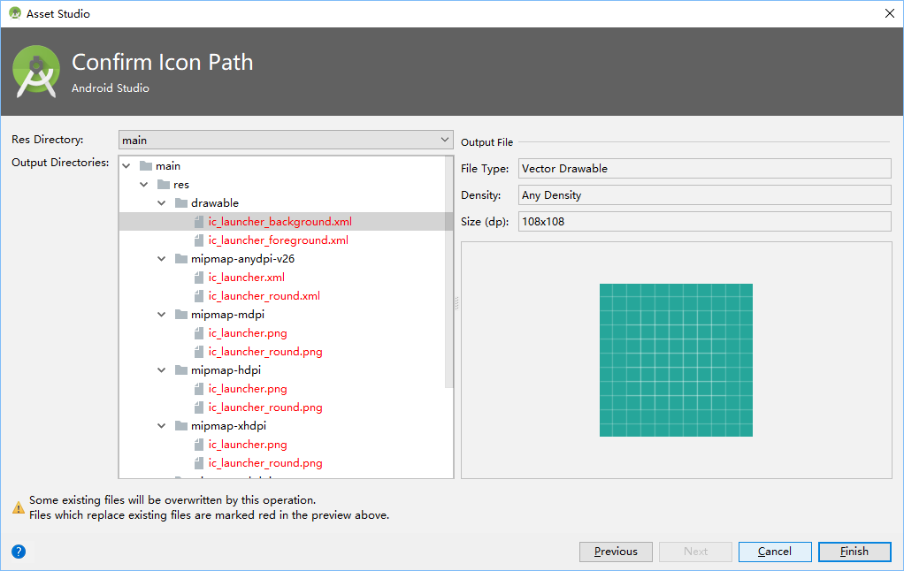

# Change launch icon

I found a icon,free for commercial use, in [Haotu](http://www.haotu.net/icon/201090/alarm-clock).

Download the icon with SVG format (alarm_clock.svg).

In AS, 'File' -> 'New' -> 'Image Asset'

In 'Foreground Layer':

* Choose the right path of download file 'alarm_clock.svg'.
* Resize it to '49%' (more or less), so clock can be fully displayed. 

then press 'Next'.

Use default settings, Press 'Finish'.
