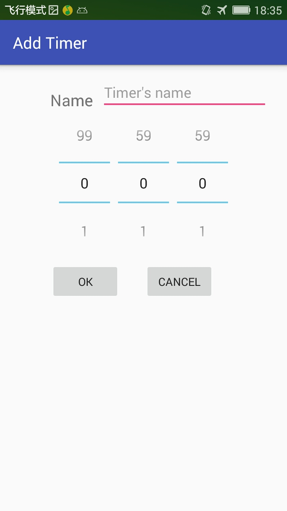

# 1. Create empty Timer Edit activity

Create a empty activity, named 'TimerEditActivity'.

Add an new action bar in MainActivity, to start TimerEditActivity. 

# 2. Support 'ADD' timer

Edit TimerEditActivity's layout and java code to create new Timer and return to MainActivity.

# 3. Support 'Edit' timer

Add a context-menu 'Edit' to the ListView in MainActivity.

When click the menu, start TimerEditActivity to EDIT the selected timer.

In TimerEditActivity:
* If the Intent has an integer extra named 'index', it means to EDIT the timer.
* Otherwise it means to ADD a timer.

# 4. Support 'Delete' timer

Add a context-menu 'Delete' to the ListView in MainActivity.

When click the menu, delete the selected timer.
