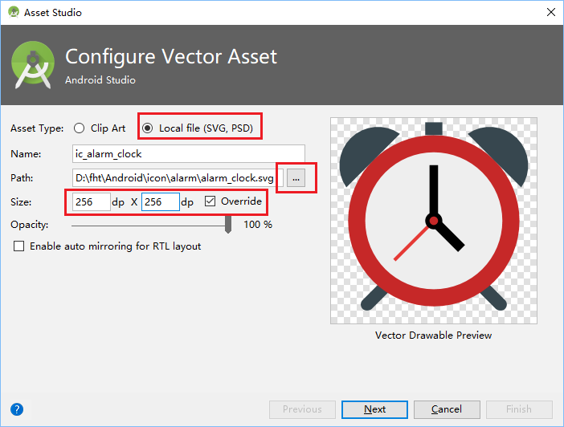
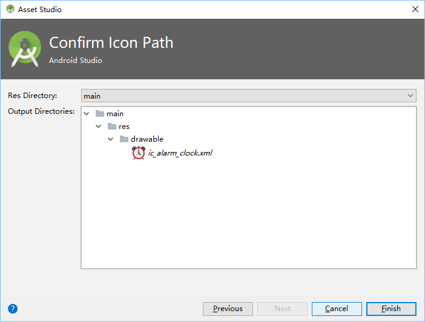

# 1. Prepare a clock icon

Again, use the [alarm_clock.svg](ref/alarm_clock.svg), which is already used in [step-2](step-2-change-launch-icon.md).

In AS, 'File' -> 'New' -> 'Ve Asset'

In 'Foreground Layer':

* Choose the right path of download file 'alarm_clock.svg'.
* Enable 'Overite', and make it 256dp. 

then press 'Next'.

Use default settings, Press 'Finish'.

# 2. Write code for AlarmActivity

Need two permissions:
* READ_EXTERNAL_STORAGE : for play songs.
* VIBRATE : for vibrate.

Set flags to make sure the activity can be shown:
* FLAG_SHOW_WHEN_LOCKED
* FLAG_TURN_SCREEN_ON

Use 'TimerTask' to stop play tone, and close activity.
