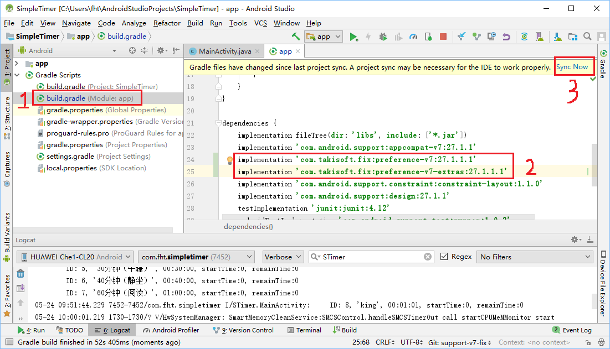

Steps for branch 'support-v7-fix'.

# 1. Add support preference v7 fix to project



1. In AS, choose 'build.gradle (Module: app)'
2. Add two lines to your gradle file
3. Click 'Sync Now'

```
implementation 'com.takisoft.fix:preference-v7:27.1.1.1'
implementation 'com.takisoft.fix:preference-v7-extras:27.1.1.1'
```

# 2. Set preferenceTheme in your theme

Add one line:

```
<item name="preferenceTheme">@style/PreferenceThemeOverlay</item>
```

# 3. Change SettingActivity & preference.xml

Use class in support-preference-v7.

# 4. Delete old SeekBarPreference

Delete all the files releated to SeekBarPreference.

